# SimpleColors-BeamerTheme

SimpleColors is a vibrant and straightforward LaTeX Beamer theme designed for simple and effective academic presentations with a clean and colorful aesthetic.

## Features

- **Simplicity**: Focuses on content with minimal distractions.
- **Colorful Design**: Utilizes a bright and engaging color palette.
- **Customization**: Easily adjustable to fit your presentation needs.


## Color Theme Previews

Theme colors are defined in the `beamercolorthemeSimpleColors.sty` file as follows:
```latex
% themes colors
\definecolor{DarkBlue}{rgb}{0.05, 0.15, 0.35}
\definecolor{DarkGreen}{rgb}{0.1, 0.35, 0.1}
\definecolor{DarkPurple}{rgb}{0.3, 0.0, 0.50}
\definecolor{DarkRed}{rgb}{0.7, 0.0, 0.0}
\definecolor{Orange}{rgb}{1.0, 0.5, 0.0} 
\definecolor{Leather}{rgb}{0.35, 0.25, 0.1}


% set current theme color
\colorlet{CurrentTheme}{DarkBlue}
``` 

> [!IMPORTANT]  
> In order to change the theme color alter the `CurrentTheme`.


The following table provides a comparison of the different color themes available in the `SimpleColors` Beamer theme. Each theme has 13 preview images that demonstrate its appearance.

| Color Theme   | Preview Title |  Preview Blocks |
|--------------|--------------|--------------|
| DarkBlue     | 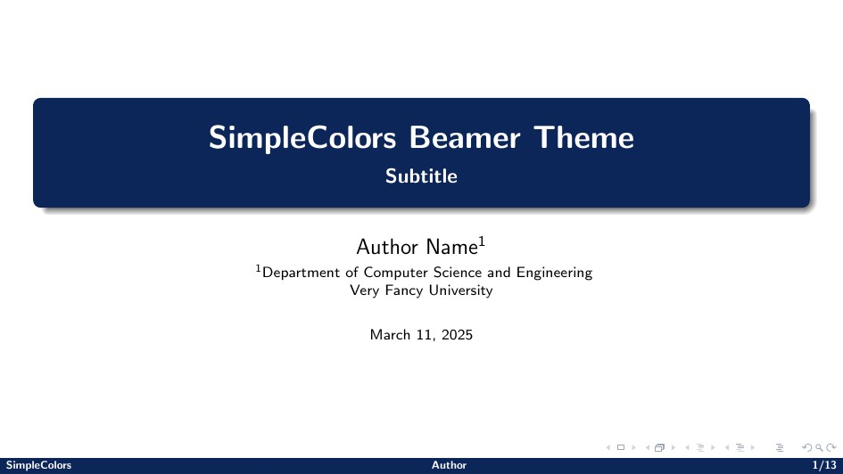 |  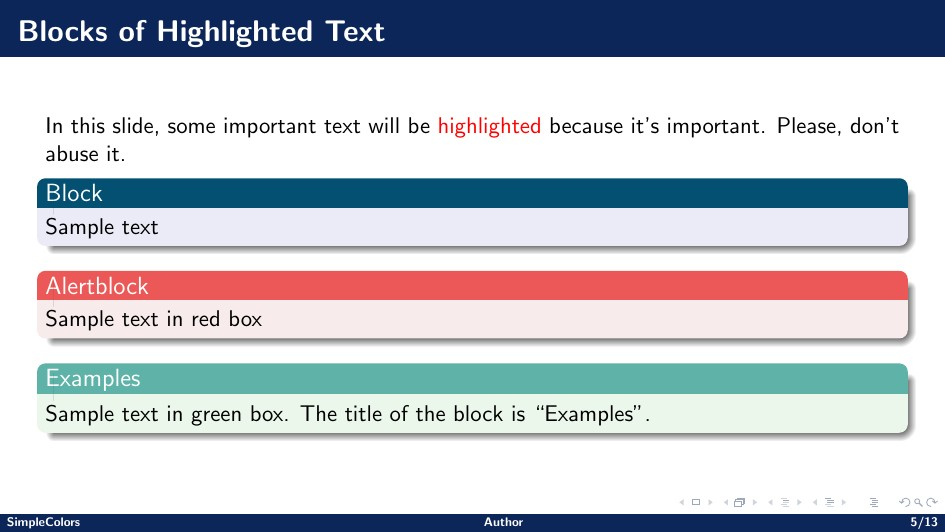 |
| DarkGreen    | 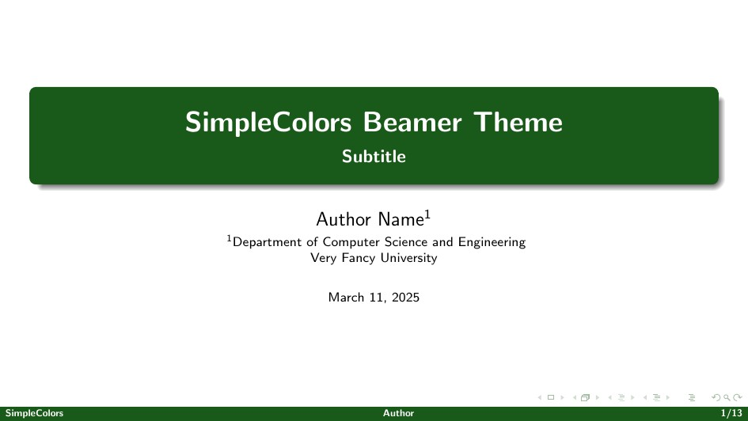 |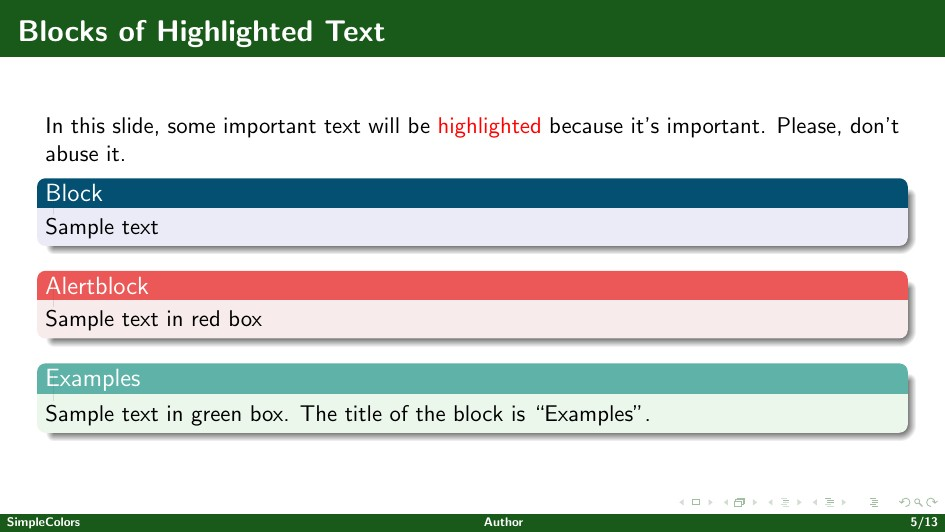 |
| DarkPurple   | 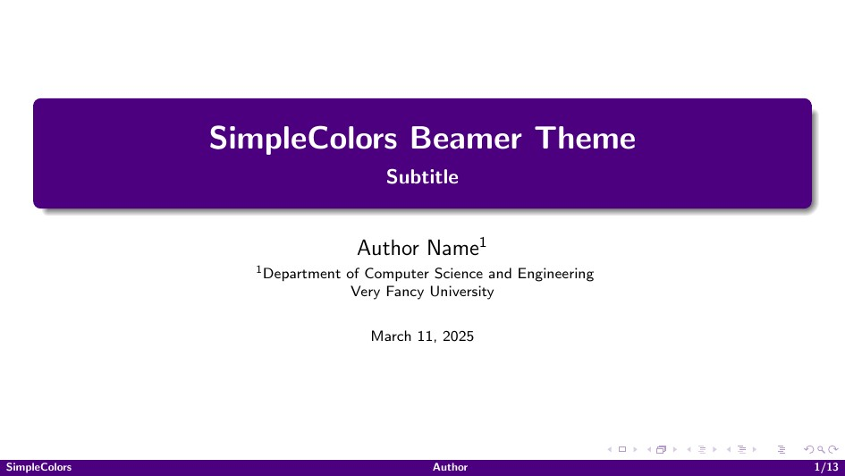 |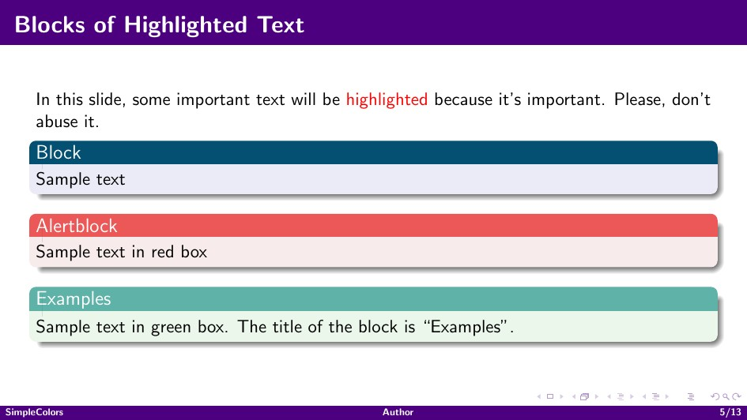 |
| DarkRed      | 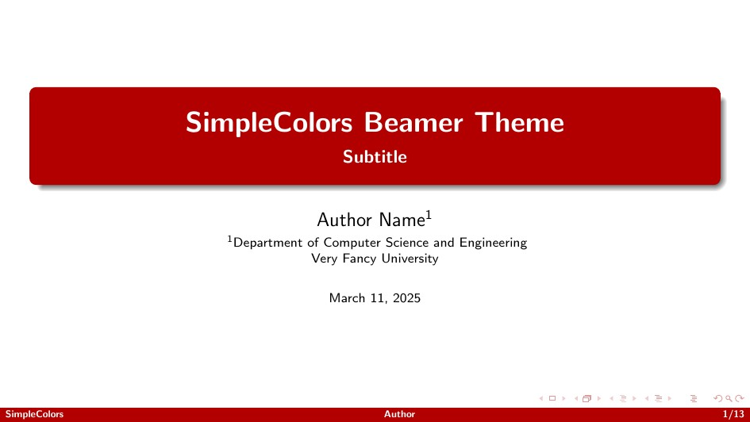 |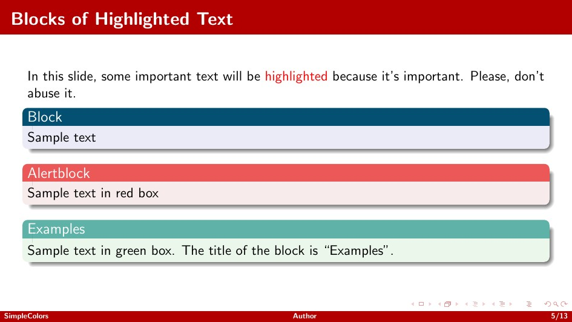 |
| Leather      | 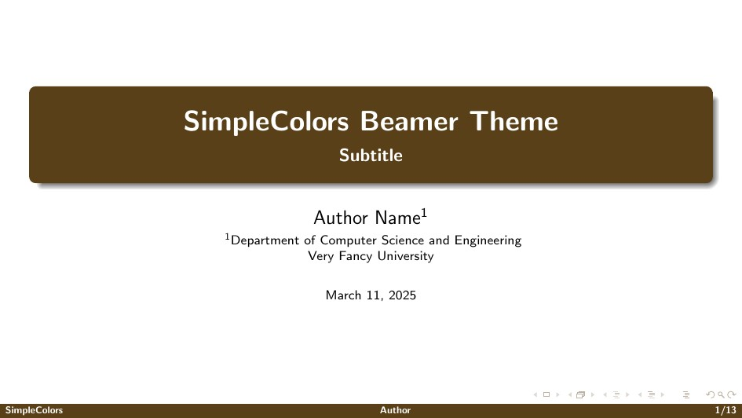 |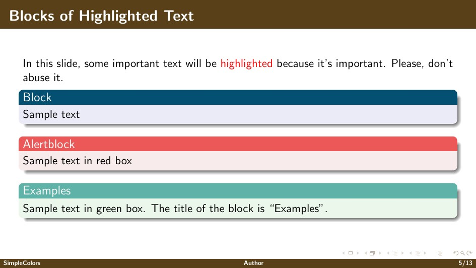 |
| Orange       | 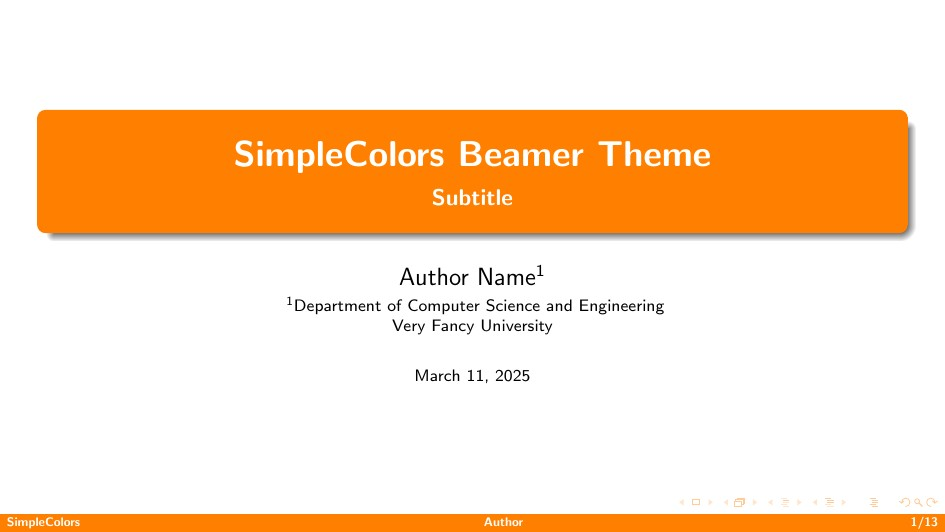 |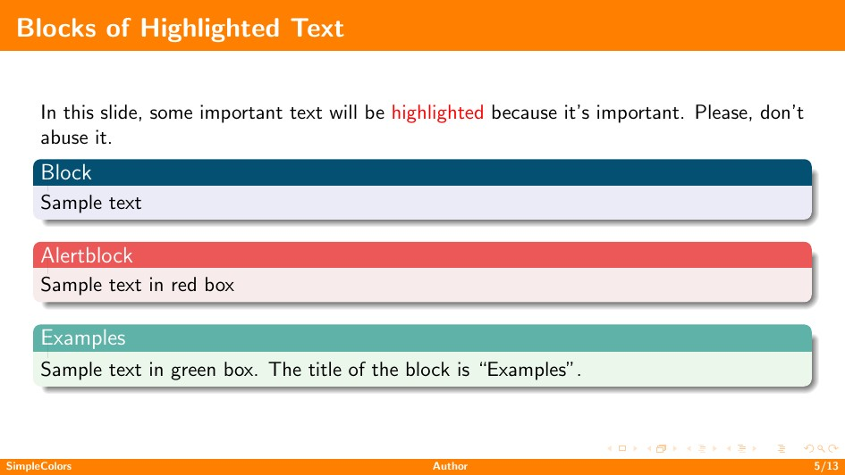 |


For a full preview of each theme, check the corresponding folder under `preview/`.


## Installation

1. **Clone the Repository**:

   ```bash
   git clone https://github.com/ACRae/SimpleColors-BeamerTheme.git
   ```

2. **Add to Your LaTeX Directory**:

    Place the `.sty` files in your LaTeX project's directory or in a directory that's part of your TeX distribution's search path.

3. **Incorporate with existing latex file**:
    
    Incorporate the theme into your Beamer presentation by adding the following lines to your .tex file's preamble:
    ```latex
    \documentclass{beamer}
    \usetheme{SimpleColors}
    ```


## License

This project is released under the **Unlicense License**, granting you complete freedom to use, modify, and distribute the template. For more details, see the [LICENSE](./LICENSE) file.

## Acknowledgements

Inspired by the minimalist approach of the [SimpleDarkBlue](https://github.com/pm25/SimpleDarkBlue-BeamerTheme) and other clean Beamer themes.